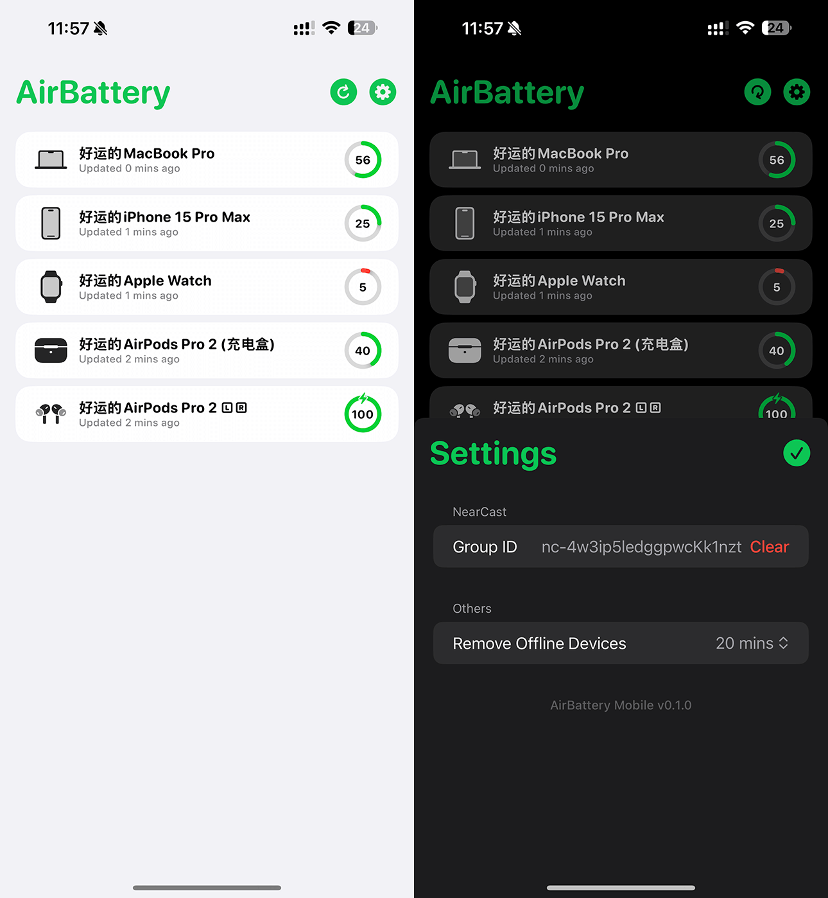

# 

<h1 align="center">AirBattery Mobile</h1>
<h3 align="center">Get battery usage for all your devices on iPhone or iPad! <a href="./README_zh.md">[中文版本]</a></h3> 

## Screenshots

## Installation and Usage
### System Requirements:
- iOS / iPadOS 14.0 or later  

> Requires AirBattery for Mac v1.5.3 or newer as the server

### Installation:
### Installation:
[Click here](../../releases/latest) to download the latest version of the installation file.  
You can sideload the app using tools like `AltStore` or `SideStore`.  

### Usage:
- AirBattery Mobile works in conjunction with AirBattery for Mac, using NearCast on your local network to pull battery data.  

- On first launch, enter your NearCast Group ID in AirBattery Mobile and ensure both your device and Mac server are on the same network.  
- Each time you open AirBattery Mobile, it automatically retrieves battery data from all servers on the network, so no manual refresh is required.  
- AirBattery Mobile only supports servers running AirBattery for Mac v1.5.3 or newer.  

## Q&A
**1. Why is AirBattery Mobile blank when I open it?**  
> Ensure your iPhone/iPad is connected to the same local network as the Mac server, and that the Mac is powered on and not in sleep mode.

**2. Can AirBattery Mobile only connect to a single Mac?**  
> No, it can retrieve battery data from any online Mac in the same NearCast Group on the local network.

**3. Will AirBattery Mobile drain my battery faster?**  
> No, the app stops all network activity when it is in the background.

**4. Why does AirBattery Mobile need access to the local network?**  
> It requires this permission to connect with AirBattery on your Mac and retrieve data using the NearCast feature.  

## Donate

## Thanks
[MultipeerKit](https://github.com/insidegui/MultipeerKit) by @insidegui  
> AirBattery Mobile uses the MultipeerKit framework for seamless peer-to-peer communication on local networks.  

[ChatGPT](https://chat.openai.com) by @OpenAI  
> Note: Some portions of this project were generated or refactored using ChatGPT.  
