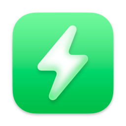
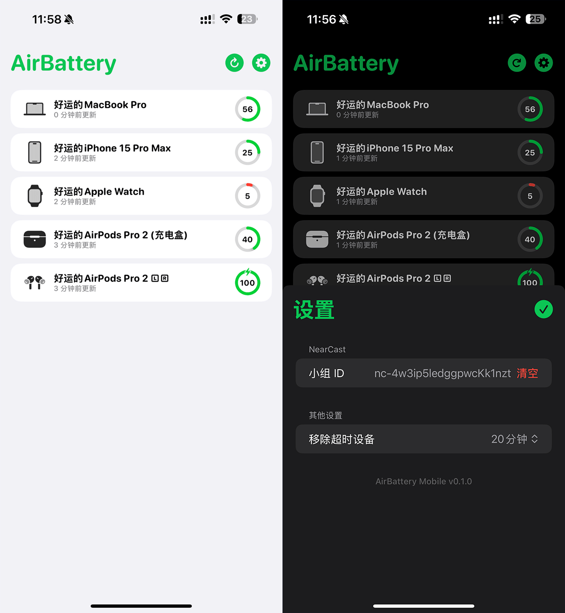

# 

<h1 align="center">AirBattery Mobile</h1>
<h3 align="center">在 iPhone 或 iPad 上获取你所有设备的电量信息! <a href="./README.md">[English Version]</a></h3> 

## 运行截图

## 安装与使用
### 系统版本要求:
- iOS / iPadOS 14.0 及更高版本  

> 需配合 AirBattery for Mac v1.5.3 或更高版本作为服务端

### 安装:
[点此前往](../../releases/latest)下载最新版安装文件. 并使用 `AltStore` 或 `SideStore` 等方式进行侧载安装.  

### 使用:
- AirBattery Mobile 无法单独工作, 它需要从局域网中安装了 AirBattery 并启用了 NearCast 功能的 Mac 上获取数据.  

- 首次使用时需要在 AirBattery Mobile 中填写您的 NearCast 小组 ID, 并保证设备与 Mac 服务端处于同一个局域网中. 
- 每当您启动 AirBattery Mobile 应用时, 它都会自动从局域网中的所有服务端拉取电量数据, 无需每次都进行手动刷新. 
- AirBattery Mobile 仅支持配合 AirBattery for Mac v1.5.3 或更高版本的服务端共同使用.  

## 常见问题
**1. 为什么启动 AirBattery Mobile 后一片空白?**.
> 请确保您已经将 iPhone/iPad 与 Mac 服务端连接至同一个局域网, 并且 Mac 没有处于关机或休眠状态.  

**2. AirBattery Mobile 只能与一台 Mac 通信吗?**  
> 不, 它可以从局域网中所有加入了同一个 NearCast 小组的在线 Mac 上拉取电池数据.  

**3. AirBattery Mobile 会加速电量消耗吗?**
> 不会, 当 App 进入后台时, 它会停止一切网络活动.  

**4. 为什么 AirBattery Mobile 需要使用局域网权限?**  
> 因为它需要从局域网中安装了 AirBattery 并启用了 NearCast 功能的 Mac 上获取数据.  

## 赞助

## 致谢 
[MultipeerKit](https://github.com/insidegui/MultipeerKit) @insidegui  
> AirBattery Mobile 使用 MultipeerKit 框架来进行局域网内的对称多端通信   

[ChatGPT](https://chat.openai.com) @OpenAI  
> 注: 本项目部分代码使用 ChatGPT 生成或重构整理
